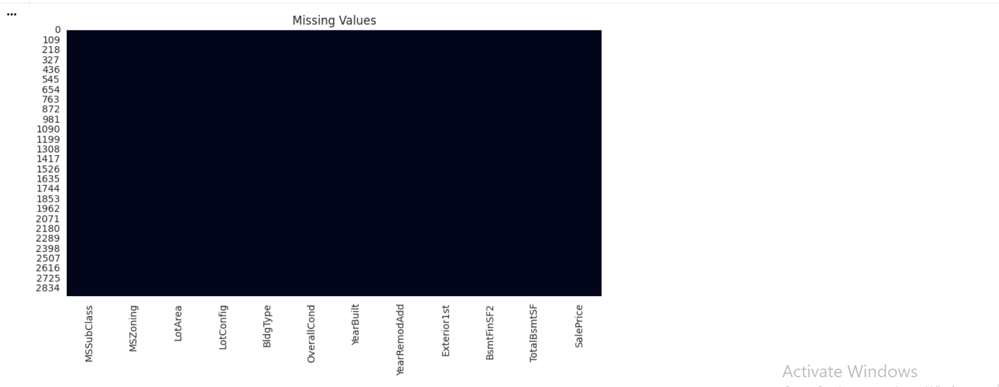
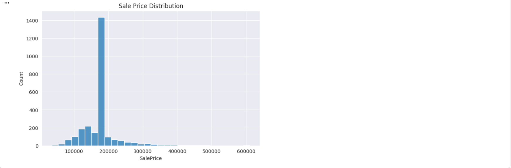
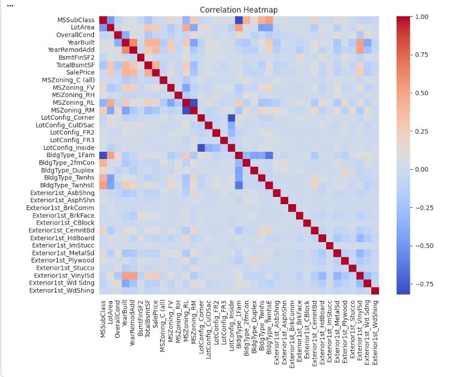
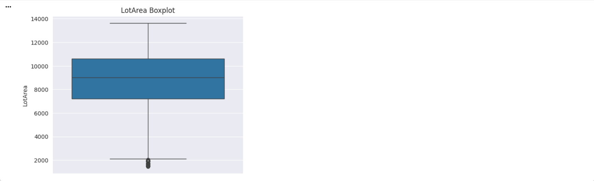
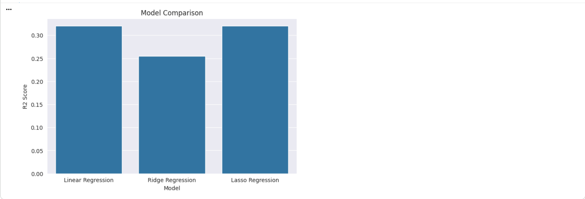
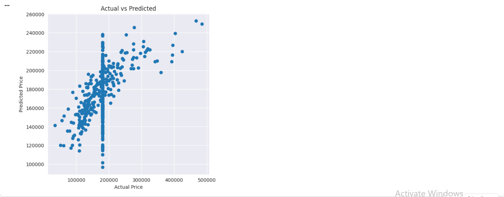
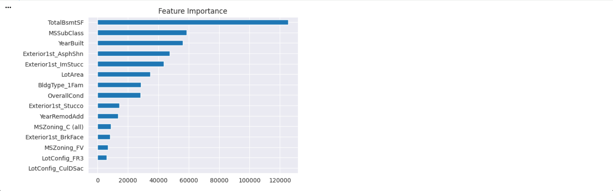

# 🏠 House Price Prediction using Machine Learning

A Machine Learning project that predicts house prices using regression algorithms. This project performs data preprocessing, feature engineering, exploratory data analysis (EDA), and compares multiple regression models to identify the best-performing approach.

---

## 📌 Project Overview

This project analyzes real estate data and predicts house prices based on multiple property features.

Three regression algorithms are compared:

- Linear Regression
- Ridge Regression
- Lasso Regression

The best model is selected using:

- R² Score
- Mean Absolute Error (MAE)
- Root Mean Squared Error (RMSE)

---

## 📂 Dataset

House Price Prediction Dataset

Rows: 2919

Columns: 13

Target Variable:

SalePrice

---

## ⚙️ Technologies Used

- Python
- Pandas
- NumPy
- Matplotlib
- Seaborn
- Scikit-learn

---

## 📊 Exploratory Data Analysis

The project includes:

- Missing Value Analysis
- Data Cleaning
- Outlier Detection
- Feature Encoding
- Feature Scaling
- Correlation Analysis

---

## 🤖 Machine Learning Models

### Linear Regression

Simple baseline regression model.

### Ridge Regression

Uses L2 Regularization.

### Lasso Regression

Uses L1 Regularization and performs feature selection.

---

## 📈 Evaluation Metrics

- R² Score
- MAE
- RMSE

---

## 📁 Project Structure

```
House_Price_Prediction
│
├── data
│   └── HousePricePrediction.csv
│
├── images
│   ├── missing_values.png
│   ├── saleprice_distribution.png
│   ├── correlation_heatmap.png
│   ├── lotarea_boxplot.png
│   ├── model_comparison.png
│   ├── actual_vs_predicted.png
│   └── feature_importance.png
│
├── notebook
│   └── House_Price_Prediction.ipynb
│
├── requirements.txt
├── README.md
└── .gitignore
```

---

## 📷 Project Output

### Missing Values



### Sale Price Distribution



### Correlation Heatmap



### LotArea Boxplot



### Model Comparison



### Actual vs Predicted



### Feature Importance



---

## 🚀 Results

- Successfully cleaned and preprocessed the dataset.
- Compared Linear, Ridge, and Lasso Regression models.
- Evaluated models using MAE, RMSE, and R² Score.
- Selected the best-performing regression model.

---

## 👨‍💻 Author

**Krantikumar Patil**

AI Engineer | Data Scientist | Java Full Stack Developer

GitHub:
https://github.com/krantii4790
